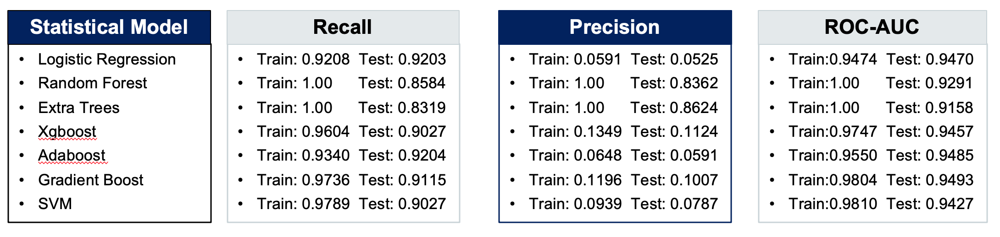

# Overview

The purpose of this project is to build an optimal machine learning model that could identify credit card fraud transactions through comparison of different statistical methods and their hyper-parameters tuning. 

# Data Introduction

The dataset could be accessed [here](https://www.kaggle.com/mlg-ulb/creditcardfraud). This dataset contains credit card transactions from a European bank in September 2013. There are 492 fraud transactions out of 284,807 transactions. Due to confidentiality protection, the feature variables only show from V1 to V28, transaction time, amount of transaction, and class which states 0 (normal) and 1 (fraud). V1 - V28 are components of PCA transformation on original features. 

After checking data types and null values, I found out that all features are float variables, and there is no null values. By looking into the value counts for each class and checking with data description, we can see that the dataset is extremely imbalanced. The majority of class is 0, which are normal transactions, while only a small portion of the dataset are fraud transactions. Due to the extreme imbalance, a correlation analysis among variables would not be as effective as expected.

# Rebalance data with SMOTE

The SMOTE method allows me to create a dataset with more balanced Classes. In SMOTE train dataset, there are 213,226 Class 1 and 213,226 Class 0. I trained my machine learning models with SMOTE dataset and validated the performances with train (70%) and test (30%) of the original dataset.

# Model Default Parameters Performance

The machine learning models I tried include Random Forest, Extratrees, Xgboost, Gradient Boost, Adaboost, Logistic Regression, and SVM. I used Recall, Precision, False Negative, False Positive, and Roc-Auc scores as evaluation metrics for model performance. In this project, False Negative represents the cases that the model predicts a transaction as normal while it is actually fraud, and False Positive represents the cases that the model predicts a transaction as fraud while it is actually normal. From a bank's perspective, I think a false negative could cause more damage than a false positive, so maximizing recall scores while maintaining a high precision is crucial for the model training.

From the table above, we could see that tree methods such as Random Forest and Extratrees perform relatively balanced based on their high recall and precision scores. Boosting methods such as Xgboost and Gradient Boost have higher recall scores, but their precision scores need significant improvements. All models seem to overfit with default parameters by comparing their train and test scores.

## Comparison with Stratified Dataset

The table above presents the result of all tested models with both original and stratified dataset. Comparing results from stratified dataset to original dataset, I found out that most of the machine learning models, except for Gradient Boost, performed better on stratified dataset, with slightly improved Recall and Precision scores on test data.

As a result, in the process of parameter tuning, I used stratified dataset on all of the machine learning models except for Gradient Boost, and I used original dataset on Gradient Boost.

# Model Performance With Optimal Parameters

The summary table above displays each machine learning model’s best results and their most optimal parameters. Based on the table, we could see that the minimal false positive and false negative are 4 and 7, which are achieved by ExtraTrees and most of the Voting Classifiers. Adaboost with ExtraTrees as base estimator performs the second best with 6 false positives and 7 false negatives. SVM and Random Forest achieve the 3rd best model performance with 7 false positives and 7 false negatives. Although Gradient Boost has significant improvement after parameter tuning, it does not perform as well as the previous models, with 20 false positives and 14 false negatives. 

Tree methods, such as ExtraTrees and Random Forest, performed very well with its default parameters. Parameter tunings failed to improve the models’ performances. SVM and boosting methods, including Adaboost, Gradient Boost, and Xgboost, improved their precision scores significantly through parameter tunings. Logistic Regression does not perform very well on identifying false positives. Most of the Voting Classifiers receive the same result as ExtraTrees with 4 false positives and 7 false negatives.
